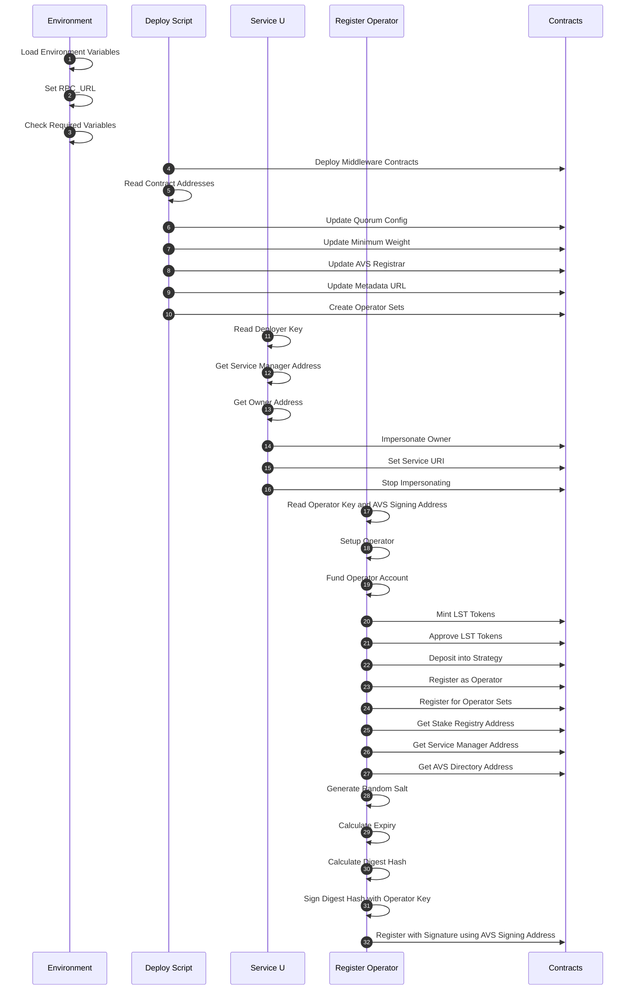

## Prerequisites

- Docker and Docker Compose
- Foundry (Forge and Cast) for local development and testing

## Testing

To run the test suite, make sure you have [Foundry](https://book.getfoundry.sh/) installed. Then run:

```bash
# Run all tests
make test
```

# Docker Quick Start

## Build

First, ensure you have all submodules:

```bash
git submodule update --init --recursive
```

Then, build the image:

```bash
docker build -t wavs-middleware .
```

## Setup

Prepare the env file:

```bash
CHAIN=
cp docker/env.example.$CHAIN docker/.env
# edit the RPC_URL, DEPLOY_ENV for a paid testnet rpc endpoint.
# edit the FORK_RPC_URL for local deployment.
```

## Testnet Fork

Start anvil in one terminal:

```bash
source docker/.env
anvil --fork-url $FORK_RPC_URL --host 0.0.0.0 --port 8545
```

## Commands

**Run all the following scripts in the `docker/` directory.**

```bash
cd docker/
```

### Deploy Contracts

Deploys the WAVS middleware contracts.

```bash
# -s bls for BLS option

docker run --rm --network host -v ./.nodes:/root/.nodes \
   --env-file .env \
   wavs-middleware deploy
```

| Environment Variable   | Required              | Default                 | Source | Description                                   |
| ---------------------- | --------------------- | ----------------------- | ------ | --------------------------------------------- |
| `DEPLOY_ENV`           | for non-default value | `LOCAL`                 | `.env` | Deployment environment (`LOCAL` or `TESTNET`) |
| `RPC_URL`              | for non-default value | `http://localhost:8545` | `.env` | RPC URL                                       |
| `FUNDED_KEY`           | Yes                   | -                       | `.env` | Private key with funds for deployment         |
| `METADATA_URI`         | Yes                   | -                       | `.env` | URI for AVS metadata                          |
| `LST_STRATEGY_ADDRESS` | for ecdsa             | -                       | `.env` | Liquid staking token strategy address         |

### Set Service URI

Sets the service URI for the service manager.

```bash
# -s bls for BLS option

docker run --rm --network host -v ./.nodes:/root/.nodes \
   --env-file .env \
   wavs-middleware set_service_uri SERVICE_URI="https://ipfs.url/for-custom-service.json"
```

| Environment Variable           | Required              | Default                       | Source | Description                                   |
| ------------------------------ | --------------------- | ----------------------------- | ------ | --------------------------------------------- |
| `DEPLOY_ENV`                   | for non-default value | `LOCAL`                       | `.env` | Deployment environment (`LOCAL` or `TESTNET`) |
| `RPC_URL`                      | for non-default value | `http://localhost:8545`       | `.env` | RPC URL                                       |
| `WAVS_SERVICE_MANAGER_ADDRESS` | if not mounted        | From `.nodes/avs_deploy.json` | Volume | Service manager contract address              |
| `FUNDED_KEY`                   | if not mounted        | From `.nodes/deployer`        | Volume | Deployer private key                          |
| `SERVICE_URI`                  | Yes                   | -                             | Params | URI for the service                           |

### Register ECDSA Operator

Registers an operator for the ECDSA service.

```bash
WAVS_SERVICE_MANAGER_ADDRESS=$(jq -r '.addresses.WavsServiceManager' .nodes/avs_deploy.json)

OPERATOR_KEY=$(cast wallet new --json | jq -r '.[0].private_key')
OPERATOR_ADDRESS=$(cast wallet addr --private-key "$OPERATOR_KEY")
echo "Operator address: $OPERATOR_ADDRESS"

AVS_KEY=$(cast wallet new --json | jq -r '.[0].private_key')
AVS_SIGNING_ADDRESS=$(cast wallet addr --private-key "$AVS_KEY")
echo "AVS signing address: $AVS_SIGNING_ADDRESS"

docker run --rm --network host \
   --env-file .env \
   -e WAVS_SERVICE_MANAGER_ADDRESS=${WAVS_SERVICE_MANAGER_ADDRESS} \
   -e OPERATOR_KEY=${OPERATOR_KEY} \
   -e WAVS_SIGNING_KEY=${AVS_SIGNING_ADDRESS} \
   wavs-middleware register WAVS_DELEGATE_AMOUNT=1000000000000000
```

### Register BLS Operator

Registers an operator for the BLS service.

```bash
WAVS_SERVICE_MANAGER_ADDRESS=$(jq -r '.addresses.WavsServiceManager' .nodes/avs_deploy.json)

OPERATOR_KEY=$(cast wallet new --json | jq -r '.[0].private_key')
OPERATOR_ADDRESS=$(cast wallet addr --private-key "$OPERATOR_KEY")
echo "Operator address: $OPERATOR_ADDRESS"

docker run --rm --network host \
   --env-file .env \
   -e WAVS_SERVICE_MANAGER_ADDRESS=${WAVS_SERVICE_MANAGER_ADDRESS} \
   -e OPERATOR_KEY=${OPERATOR_KEY} \
   wavs-middleware -s bls register WAVS_DELEGATE_AMOUNT=1000000000000000000
```

| Environment Variable           | Required              | Default                       | Source       | Description                                   |
| ------------------------------ | --------------------- | ----------------------------- | ------------ | --------------------------------------------- |
| `DEPLOY_ENV`                   | for non-default value | `LOCAL`                       | `.env`       | Deployment environment (`LOCAL` or `TESTNET`) |
| `RPC_URL`                      | for non-default value | `http://localhost:8545`       | `.env`       | RPC URL                                       |
| `LST_CONTRACT_ADDRESS`         | Yes                   | -                             | `.env`       | Liquid staking token contract address         |
| `LST_STRATEGY_ADDRESS`         | Yes                   | -                             | `.env`       | Liquid staking token strategy address         |
| `WAVS_SERVICE_MANAGER_ADDRESS` | if not mounted        | From `.nodes/avs_deploy.json` | Command line | Service manager contract address              |
| `OPERATOR_KEY`                 | Yes                   | -                             | Command line | Private key for the operator                  |
| `WAVS_SIGNING_KEY`             | for ecdsa             | -                             | Command line | Address of the AVS signing key                |
| `WAVS_DELEGATE_AMOUNT`         | Yes                   | -                             | Params       | Amount to delegate to the operator            |

### Deregister ECDSA Operator

Deregisters an operator from the ECDSA service.

```bash
WAVS_SERVICE_MANAGER_ADDRESS=$(jq -r '.addresses.WavsServiceManager' .nodes/avs_deploy.json)

docker run --rm --network host \
   --env-file .env \
   -e WAVS_SERVICE_MANAGER_ADDRESS=${WAVS_SERVICE_MANAGER_ADDRESS} \
   -e OPERATOR_KEY=${OPERATOR_KEY} \
   wavs-middleware deregister
```

| Environment Variable           | Required              | Default                       | Source       | Description                                   |
| ------------------------------ | --------------------- | ----------------------------- | ------------ | --------------------------------------------- |
| `DEPLOY_ENV`                   | for non-default value | `LOCAL`                       | `.env`       | Deployment environment (`LOCAL` or `TESTNET`) |
| `RPC_URL`                      | for non-default value | `http://localhost:8545`       | `.env`       | RPC URL                                       |
| `WAVS_SERVICE_MANAGER_ADDRESS` | if not mounted        | From `.nodes/avs_deploy.json` | Command line | Service manager contract address              |
| `OPERATOR_KEY`                 | Yes                   | -                             | Command line | Private key for the operator                  |

### List Operators

Lists all registered operators for the service.

```bash
# ECDSA list operators
WAVS_SERVICE_MANAGER_ADDRESS=$(jq -r '.addresses.WavsServiceManager' .nodes/avs_deploy.json)

docker run --rm --network host \
   --env-file .env \
   -e WAVS_SERVICE_MANAGER_ADDRESS=${WAVS_SERVICE_MANAGER_ADDRESS} \
   wavs-middleware list_operators
```

```bash
# BLS list operators
docker run --rm --network host -v ./.nodes:/root/.nodes \
   --env-file .env \
   wavs-middleware -s bls list_operators
```

| Environment Variable           | Required              | Default                       | Source       | Description                                   |
| ------------------------------ | --------------------- | ----------------------------- | ------------ | --------------------------------------------- |
| `DEPLOY_ENV`                   | for non-default value | `LOCAL`                       | `.env`       | Deployment environment (`LOCAL` or `TESTNET`) |
| `RPC_URL`                      | for non-default value | `http://localhost:8545`       | `.env`       | RPC URL                                       |
| `WAVS_SERVICE_MANAGER_ADDRESS` | if not mounted        | From `.nodes/avs_deploy.json` | Command line | Service manager contract address              |

### Update Quorum

Updates the quorum configuration for the service.

```bash
# -s bls for BLS option

docker run --rm --network host -v ./.nodes:/root/.nodes \
   --env-file .env \
   wavs-middleware update_quorum QUORUM_NUMERATOR=3 QUORUM_DENOMINATOR=5
```

| Environment Variable           | Required              | Default                       | Source | Description                                   |
| ------------------------------ | --------------------- | ----------------------------- | ------ | --------------------------------------------- |
| `DEPLOY_ENV`                   | for non-default value | `LOCAL`                       | `.env` | Deployment environment (`LOCAL` or `TESTNET`) |
| `RPC_URL`                      | for non-default value | `http://localhost:8545`       | `.env` | RPC URL                                       |
| `WAVS_SERVICE_MANAGER_ADDRESS` | if not mounted        | From `.nodes/avs_deploy.json` | Volume | Service manager contract address              |
| `FUNDED_KEY`                   | if not mounted        | From `.nodes/deployer`        | Volume | Deployer private key                          |
| `QUORUM_NUMERATOR`             | Yes                   | -                             | Params | Numerator for quorum calculation              |
| `QUORUM_DENOMINATOR`           | Yes                   | -                             | Params | Denominator for quorum calculation            |

### Pause Registration

Pauses operator registration for the service.

```bash
# -s bls for BLS option

# ECDSA registry address
# REGISTRY_ADDRESS=$(jq -r '.addresses.avsRegistrar' "$HOME/.nodes/avs_deploy.json")

# BLS registry address
# REGISTRY_ADDRESS=$(jq -r '.addresses.registryCoordinator' "$HOME/.nodes/avs_deploy.json")

docker run --rm --network host -v ./.nodes:/root/.nodes \
   --env-file .env \
   wavs-middleware pause
```

### Unpause Registration

Unpauses operator registration for the service.

```bash
# -s bls for BLS option

# ECDSA registry address
# REGISTRY_ADDRESS=$(jq -r '.addresses.avsRegistrar' "$HOME/.nodes/avs_deploy.json")

# BLS registry address
# REGISTRY_ADDRESS=$(jq -r '.addresses.registryCoordinator' "$HOME/.nodes/avs_deploy.json")

docker run --rm --network host -v ./.nodes:/root/.nodes \
   --env-file .env \
   wavs-middleware unpause
```

| Environment Variable | Required              | Default                       | Source | Description                                   |
| -------------------- | --------------------- | ----------------------------- | ------ | --------------------------------------------- |
| `DEPLOY_ENV`         | for non-default value | `LOCAL`                       | `.env` | Deployment environment (`LOCAL` or `TESTNET`) |
| `RPC_URL`            | for non-default value | `http://localhost:8545`       | `.env` | RPC URL                                       |
| `REGISTRY_ADDRESS`   | if not mounted        | From `.nodes/avs_deploy.json` | Volume | AVS registrar address                         |
| `FUNDED_KEY`         | if not mounted        | From `.nodes/deployer`        | Volume | Deployer private key                          |

### Transfer Ownership

Transfers ownership of the service contracts to new owners.

```bash
PROXY_OWNER=$(cast wallet new --json | jq -r '.[0].private_key')
PROXY_OWNER_ADDRESS=$(cast wallet addr --private-key "$PROXY_OWNER")
echo "Proxy owner address: $PROXY_OWNER_ADDRESS"
AVS_OWNER=$(cast wallet new --json | jq -r '.[0].private_key')
AVS_OWNER_ADDRESS=$(cast wallet addr --private-key "$AVS_OWNER")
echo "Avs owner address: $AVS_OWNER_ADDRESS"

# WAVS_SERVICE_MANAGER_ADDRESS=$(jq -r '.addresses.WavsServiceManager' .nodes/avs_deploy.json)

docker run --rm --network host -v ./.nodes:/root/.nodes \
   --env-file .env \
   wavs-middleware transfer_ownership ${PROXY_OWNER} ${AVS_OWNER}
```

| Environment Variable           | Required              | Default                       | Source | Description                                    |
| ------------------------------ | --------------------- | ----------------------------- | ------ | ---------------------------------------------- |
| `DEPLOY_ENV`                   | for non-default value | `LOCAL`                       | `.env` | Deployment environment (`LOCAL` or `TESTNET`)  |
| `RPC_URL`                      | for non-default value | `http://localhost:8545`       | `.env` | RPC URL                                        |
| `WAVS_SERVICE_MANAGER_ADDRESS` | if not mounted        | From `.nodes/avs_deploy.json` | volume | Service manager contract address               |
| `FUNDED_KEY`                   | if not mounted        | From `.nodes/deployer`        | Volume | Deployer private key                           |
| `PROXY_OWNER`                  | Yes                   | -                             | Params | New owner for proxy admin                      |
| `AVS_OWNER`                    | Yes                   | -                             | Params | New owner for AVS registrar and stake registry |

### Delegate to Operator

Delegates tokens to an operator.

```bash
WAVS_SERVICE_MANAGER_ADDRESS=$(jq -r '.addresses.WavsServiceManager' .nodes/avs_deploy.json)

STAKER_KEY=$(cast wallet new --json | jq -r '.[0].private_key')
STAKER_ADDRESS=$(cast wallet addr --private-key "$STAKER_KEY")
echo "Staker address: $STAKER_ADDRESS"

docker run --rm --network host \
   --env-file .env \
   -e WAVS_SERVICE_MANAGER_ADDRESS=${WAVS_SERVICE_MANAGER_ADDRESS} \
   -e STAKER_KEY=${STAKER_KEY} \
   -e OPERATOR_ADDRESS=${OPERATOR_ADDRESS} \
   wavs-middleware delegate_to_operator WAVS_DELEGATE_AMOUNT=1000000000000000
```

### Delegate to Operator with Approver

Delegates tokens to an operator with delegation approver.

```bash
docker run --rm --network host \
   --env-file .env \
   -e STAKER_KEY=${STAKER_KEY} \
   -e OPERATOR_ADDRESS=${OPERATOR_ADDRESS} \
   -e DELEGATION_APPROVER_PRIVATE_KEY=${DELEGATION_APPROVER_PRIVATE_KEY} \
   -e DELEGATION_APPROVER_SALT=${DELEGATION_APPROVER_SALT} \
   -e DELEGATION_DURATION=${DELEGATION_DURATION} \
   wavs-middleware delegate_to_operator WAVS_DELEGATE_AMOUNT=1000000000000000
```

| Environment Variable              | Required              | Default                       | Source       | Description                                   |
| --------------------------------- | --------------------- | ----------------------------- | ------------ | --------------------------------------------- |
| `DEPLOY_ENV`                      | for non-default value | `LOCAL`                       | `.env`       | Deployment environment (`LOCAL` or `TESTNET`) |
| `RPC_URL`                         | for non-default value | `http://localhost:8545`       | `.env`       | RPC URL                                       |
| `LST_CONTRACT_ADDRESS`            | Yes                   | -                             | `.env`       | Liquid staking token contract address         |
| `LST_STRATEGY_ADDRESS`            | Yes                   | -                             | `.env`       | Liquid staking token strategy address         |
| `WAVS_SERVICE_MANAGER_ADDRESS`    | if not mounted        | From `.nodes/avs_deploy.json` | Command line | Service manager contract address              |
| `STAKER_KEY`                      | Yes                   | -                             | Command line | Private key for the staker                    |
| `OPERATOR_ADDRESS`                | Yes                   | -                             | Command line | Address of the operator to delegate to        |
| `DELEGATION_APPROVER_PRIVATE_KEY` | if approver is active | `0x0000...`                   | Command line | Private key for delegation approver           |
| `DELEGATION_APPROVER_SALT`        | if approve is active  | `0x0000...`                   | Command line | Salt for delegation approver                  |
| `DELEGATION_DURATION`             | if approve is active  | `0`                           | Command line | Duration for delegation                       |
| `WAVS_DELEGATE_AMOUNT`            | Yes                   | -                             | Params       | Amount to delegate to the operator            |

## Mirror Deployment

### Deploy Mirror Contracts

Deploys mirror contracts to match the first anvil instance.

```bash
anvil --host 0.0.0.0 --port 8546
```

```bash
docker run --rm --network host -v ./.nodes:/root/.nodes \
   wavs-middleware -m mirror deploy
```

| Environment Variable           | Required              | Default                       | Source       | Description                                   |
| ------------------------------ | --------------------- | ----------------------------- | ------------ | --------------------------------------------- |
| `DEPLOY_ENV`                   | for non-default value | `LOCAL`                       | `.env`       | Deployment environment (`LOCAL` or `TESTNET`) |
| `WAVS_SERVICE_MANAGER_ADDRESS` | if not mounted        | From `.nodes/avs_deploy.json` | Volume       | Service manager contract address              |
| `FUNDED_KEY`                   | if not mounted        | From `.nodes/deployer`        | Volume       | Deployer private key                          |
| `SOURCE_RPC_URL`               | for non-default value | `http://localhost:8545`       | Command line | RPC URL for source chain                      |
| `MIRROR_RPC_URL`               | for non-default value | `http://localhost:8546`       | Command line | RPC URL for mirror chain                      |

### List Mirror Operators

Lists operators on the mirror chain.

```bash
# SOURCE_SERVICE_MANAGER_ADDRESS=$(jq -r '.addresses.WavsServiceManager' ".nodes/avs_deploy.json")
# MIRROR_SERVICE_MANAGER_ADDRESS=$(jq -r '.addresses.WavsServiceManager' ".nodes/mirror.json")

docker run --rm --network host -v ./.nodes:/root/.nodes \
   wavs-middleware -m mirror list_operators
```

| Environment Variable             | Required              | Default                       | Source       | Description                                   |
| -------------------------------- | --------------------- | ----------------------------- | ------------ | --------------------------------------------- |
| `DEPLOY_ENV`                     | for non-default value | `LOCAL`                       | `.env`       | Deployment environment (`LOCAL` or `TESTNET`) |
| `SOURCE_SERVICE_MANAGER_ADDRESS` | if not mounted        | From `.nodes/avs_deploy.json` | Volume       | Source service manager address                |
| `MIRROR_SERVICE_MANAGER_ADDRESS` | if not mounted        | From `.nodes/mirror.json`     | Volume       | Mirror service manager address                |
| `SOURCE_RPC_URL`                 | for non-default value | -                             | Command line | RPC URL for source chain                      |
| `MIRROR_RPC_URL`                 | for non-default value | -                             | Command line | RPC URL for mirror chain                      |

## Mock Deployment

This deployment process is for local testing and development. It deploys a "mock" version of the WAVS middleware contracts by using the mock stage of the mirror deployment scripts. This allows for rapid testing without needing to interact with a live EigenLayer environment.

### 1. Run a Local Blockchain

```bash
anvil --host 0.0.0.0 --port 8546
```

### 2. Deploy Empty Mock Contracts

```bash
MOCK_DEPLOYER_KEY=$(cast wallet new --json | jq -r '.[0].private_key')
MOCK_DEPLOYER_ADDRESS=$(cast wallet addr --private-key "$MOCK_DEPLOYER_KEY")
echo "Mock deployer address: $MOCK_DEPLOYER_ADDRESS"

docker run --rm --network host -v ./.nodes:/root/.nodes \
   --env-file .env \
   -e MOCK_DEPLOYER_KEY=${MOCK_DEPLOYER_KEY} \
   wavs-middleware -m mock deploy
```

This will write the deployed contract addresses to `./.nodes/mock.json` (where `./nodes` is whatever you mounted your volume to)

| Environment Variable | Required              | Default                 | Source       | Description                                   |
| -------------------- | --------------------- | ----------------------- | ------------ | --------------------------------------------- |
| `DEPLOY_ENV`         | for non-default value | `LOCAL`                 | `.env`       | Deployment environment (`LOCAL` or `TESTNET`) |
| `MOCK_DEPLOYER_KEY`  | Yes                   | -                       | Command line | Private key for mock deployment               |
| `MOCK_RPC_URL`       | for non-default value | `http://localhost:8546` | Command line | RPC URL for mock blockchain                   |
| `DEPLOY_FILE_MOCK`   | for non-default value | `mock`                  | Command line | File name to store mock deployment            |

### 3. Create a Configuration File

Create a `mock-config.json` file on your local machine. This file defines the initial operators, their signing keys, weights, and the threshold for the stake registry.

```json
{
  "operators": [
    "0x7E5F4552091A69125d5DfCb7b8C2659029395Bdf",
    "0x2B5AD5c4795c026514f8317c7a215E218DcCD6cF",
    "0x6813Eb9362372EEF6200f3b1dbC3f819671cBA69",
    "0x1efF47bc3a10a45D4B230B5d10E37751FE6AA718",
    "0xe1AB8145F7E55DC933d51a18c793F901A3A0b276"
  ],
  "quorumDenominator": 3,
  "quorumNumerator": 2,
  "signingKeyAddresses": [
    "0x7E5F4552091A69125d5DfCb7b8C2659029395Bdf",
    "0x2B5AD5c4795c026514f8317c7a215E218DcCD6cF",
    "0x6813Eb9362372EEF6200f3b1dbC3f819671cBA69",
    "0x1efF47bc3a10a45D4B230B5d10E37751FE6AA718",
    "0xe1AB8145F7E55DC933d51a18c793F901A3A0b276"
  ],
  "threshold": 12345,
  "weights": [10000, 10000, 10000, 10000, 10000]
}
```

### 4. Configure Mock Contracts

```bash
# Set the path to your local config file
LOCAL_CONFIG_PATH=$(pwd) # file path that contains config file
CONFIGURE_FILE=wavs-mock-config
MOCK_SERVICE_MANAGER_ADDRESS=$(jq -r '.addresses.WavsServiceManager' .nodes/mock.json)

docker run --rm --network host -v ./.nodes:/root/.nodes \
   -v $LOCAL_CONFIG_PATH:/wavs/contracts/deployments \
   --env-file .env \
   wavs-middleware -m mock configure
```

| Environment Variable           | Required              | Default                     | Source       | Description                                   |
| ------------------------------ | --------------------- | --------------------------- | ------------ | --------------------------------------------- |
| `DEPLOY_ENV`                   | for non-default value | `LOCAL`                     | `.env`       | Deployment environment (`LOCAL` or `TESTNET`) |
| `MOCK_RPC_URL`                 | for non-default value | `http://localhost:8546`     | Command line | RPC URL for mock blockchain                   |
| `MOCK_DEPLOYER_KEY`            | if not mounted        | From `.nodes/mock-deployer` | Volume       | Deployer private key                          |
| `MOCK_SERVICE_MANAGER_ADDRESS` | if not mounted        | From `.nodes/mock.json`     | Volume       | Service manager contract address              |
| `DEPLOY_FILE_MOCK`             | for non-default value | `mock`                      | Command line | File name to store mock deployment            |
| `CONFIGURE_FILE`               | for non-default value | `wavs-mock-config`          | Command line | File name to read configuration data          |

### 5. Mock Transfer Ownership

Transfers ownership of the mock service contracts to new owners.

```bash
PROXY_OWNER=$(cast wallet new --json | jq -r '.[0].private_key')
PROXY_OWNER_ADDRESS=$(cast wallet addr --private-key "$PROXY_OWNER")
echo "Proxy owner address: $PROXY_OWNER_ADDRESS"
AVS_OWNER=$(cast wallet new --json | jq -r '.[0].private_key')
AVS_OWNER_ADDRESS=$(cast wallet addr --private-key "$AVS_OWNER")
echo "Avs owner address: $AVS_OWNER_ADDRESS"

docker run --rm --network host -v ./.nodes:/root/.nodes \
   --env-file .env \
   wavs-middleware -m mock transfer_ownership ${PROXY_OWNER} ${AVS_OWNER}
```

| Environment Variable           | Required              | Default                     | Source       | Description                                    |
| ------------------------------ | --------------------- | --------------------------- | ------------ | ---------------------------------------------- |
| `DEPLOY_ENV`                   | for non-default value | `LOCAL`                     | `.env`       | Deployment environment (`LOCAL` or `TESTNET`)  |
| `MOCK_RPC_URL`                 | for non-default value | `http://localhost:8546`     | Command line | RPC URL for mock blockchain                    |
| `MOCK_DEPLOYER_KEY`            | if not mounted        | From `.nodes/mock-deployer` | Volume       | Deployer private key                           |
| `WAVS_SERVICE_MANAGER_ADDRESS` | if not mounted        | From `.nodes/mock.json`     | Volume       | Service manager contract address               |
| `PROXY_OWNER`                  | Yes                   | -                           | Params       | New owner for proxy admin                      |
| `AVS_OWNER`                    | Yes                   | -                           | Params       | New owner for AVS registrar and stake registry |

## Deploy Testnet

Same as the local deploy, change `DEPLOY_ENV` to `"TESTNET"` and make sure the `FUNDED_KEY` is actually funded on testnet

## References

- [EigenLayer Documentation](https://docs.eigenlayer.xyz/)
- [Hello World AVS Repository](https://github.com/Layr-Labs/hello-world-avs)

## Deployment Process Flow



## Detailed Process Explanation

### Initial Setup

- Load environment variables from `.env` file
- Set `RPC_URL` based on environment (TESTNET or LOCAL)
- Check for required environment variables

### Deploy Process (deploy.sh)

1. Deploy middleware contracts using Forge script
2. Read contract addresses from deployment JSON
3. Update quorum config with strategy weights
4. Set minimum weight for operators
5. Configure AVS registrar
6. Update metadata URL for EigenLayer frontend
7. Create operator sets for meta-AVS functionality

### Set Service URI (set_service_uri.sh)

1. Read deployer private key from file
2. Get service manager address from deployment JSON
3. Get owner address from service manager contract
4. Impersonate owner account (LOCAL only)
5. Set service URI on service manager contract
6. Stop impersonating owner account

### Register Operator (register.sh)

1. Read operator private key and AVS signing address from command line
2. Setup operator with initial configuration
3. Fund operator account with ETH
4. Mint LST tokens for operator
5. Approve LST tokens for strategy manager
6. Deposit LST tokens into strategy
7. Register as operator with delegation manager
8. Register for operator sets with allocation manager
9. Register with AVS using signature:
   - Get stake registry address
   - Get service manager address
   - Get AVS directory address
   - Generate random salt
   - Calculate expiry time
   - Calculate digest hash
   - Sign digest hash with operator's private key
   - Register with signature on stake registry, using the AVS signing address as the signing key

### Helper Functions (helpers.sh)

- `wait_for_ethereum`: Check if Ethereum node is ready
- `impersonate_account`: Impersonate an account (LOCAL only)
- `execute_transaction`: Run a transaction and handle errors
- `stop_impersonating`: Stop impersonating an account (LOCAL only)

### Instructions on getting Holesky ETH

To get Holesky ETH for running on testnet:

1. PoW Mining Faucet:

   - Go to https://holesky-faucet.pk910.de/
   - Connect your wallet
   - Mine blocks in your browser to earn ETH
   - Rewards based on mining time/hashrate
   - No external requirements

2. Alchemy Faucet (Alternative):
   - Visit https://www.alchemy.com/faucets/holesky
   - Requires mainnet ETH balance to use
   - Connect wallet and verify ownership
   - Request funds (limits apply)
