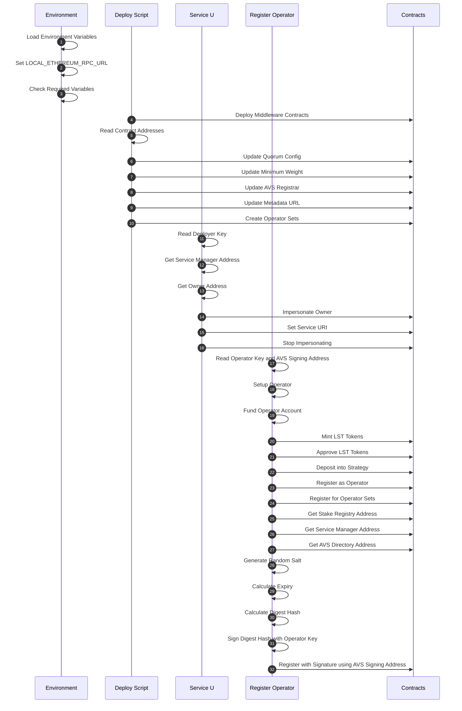

## Prerequisites

- Docker and Docker Compose
- Foundry (Forge and Cast) for local development and testing

## Testing

To run the test suite, make sure you have [Foundry](https://book.getfoundry.sh/) installed. Then run:

```bash
# Run all tests
make test
```

# Docker Quick start

## Build

First, ensure you have all submodules:

```bash
git submodule update --init --recursive
```

Then, build the image:

```bash
docker build -t wavs-middleware .
```

## Setup

Prepare the env file:

```bash
cp docker/env.example docker/.env
# edit the RPC_URL for a paid testnet rpc endpoint, add funded key, and TESTNET_RPC_URL
```

## Testnet Fork

Start anvil in one terminal:

```bash
RPC_URL=https://ethereum-holesky-rpc.publicnode.com
anvil --fork-url $RPC_URL --host 0.0.0.0 --port 8545
```

## Deploy

**Run all the following scripts in the `docker/` directory.**

```bash
cd docker/
```

Deploy:

```bash
# ecdsa contracts deployment
FUNDED_KEY=
METADATA_URI=https://wavs.xyz/metadata.json
LST_STRATEGY_ADDRESS=0x7D704507b76571a51d9caE8AdDAbBFd0ba0e63d3

docker run --rm --network host -v ./.nodes:/root/.nodes \
   -e DEPLOY_ENV=${DEPLOY_ENV} \
   -e LOCAL_ETHEREUM_RPC_URL=${LOCAL_ETHEREUM_RPC_URL} \
   -e TESTNET_RPC_URL=${TESTNET_RPC_URL} \
   -e FUNDED_KEY=${FUNDED_KEY} \
   -e METADATA_URI=${METADATA_URI} \
   -e LST_STRATEGY_ADDRESS=${LST_STRATEGY_ADDRESS} \
   wavs-middleware deploy

# bls contracts deployment
FUNDED_KEY=
METADATA_URI=https://wavs.xyz/metadata.json

docker run --rm --network host -v ./.nodes:/root/.nodes \
   -e DEPLOY_ENV=${DEPLOY_ENV} \
   -e LOCAL_ETHEREUM_RPC_URL=${LOCAL_ETHEREUM_RPC_URL} \
   -e TESTNET_RPC_URL=${TESTNET_RPC_URL} \
   -e FUNDED_KEY=${FUNDED_KEY} \
   -e METADATA_URI=${METADATA_URI} \
   wavs-middleware -s bls deploy
```

Set Service URI:

```bash
SERVICE_URI="https://ipfs.url/for-custom-service.json"

docker run --rm --network host -v ./.nodes:/root/.nodes \
   -e DEPLOY_ENV=${DEPLOY_ENV} \
   -e LOCAL_ETHEREUM_RPC_URL=${LOCAL_ETHEREUM_RPC_URL} \
   -e TESTNET_RPC_URL=${TESTNET_RPC_URL} \
   -e WAVS_SERVICE_MANAGER_ADDRESS=${WAVS_SERVICE_MANAGER_ADDRESS} \
   -e SERVICE_URI=${SERVICE_URI} \
   wavs-middleware set_service_uri

SERVICE_URI="https://ipfs.url/for-custom-service.json"

docker run --rm --network host -v ./.nodes:/root/.nodes \
   -e DEPLOY_ENV=${DEPLOY_ENV} \
   -e LOCAL_ETHEREUM_RPC_URL=${LOCAL_ETHEREUM_RPC_URL} \
   -e TESTNET_RPC_URL=${TESTNET_RPC_URL} \
   -e WAVS_SERVICE_MANAGER_ADDRESS=${WAVS_SERVICE_MANAGER_ADDRESS} \
   -e SERVICE_URI=${SERVICE_URI} \
   wavs-middleware -s bls set_service_uri
```

Register:

```bash
# ECDSA opeartor registration
# Generate a new private key for the operator (needs ETH for transactions)
OPERATOR_KEY=$(cast wallet new --json | jq -r '.[0].private_key')
OPERATOR_ADDRESS=$(cast wallet addr --private-key "$OPERATOR_KEY")
echo "Operator address: $OPERATOR_ADDRESS"

export WAVS_SERVICE_MANAGER_ADDRESS=$(jq -r '.addresses.WavsServiceManager' .nodes/avs_deploy.json)
export LST_CONTRACT_ADDRESS=0x3F1c547b21f65e10480dE3ad8E19fAAC46C95034

# Generate or use an existing AVS signing key address
# Option 1: Generate a new AVS signing key
AVS_KEY=$(cast wallet new --json | jq -r '.[0].private_key')
AVS_SIGNING_ADDRESS=$(cast wallet addr --private-key "$AVS_KEY")
echo "AVS signing address: $AVS_SIGNING_ADDRESS"

# Option 2: Use an existing AVS signing address from your AVS node
# AVS_SIGNING_ADDRESS="0x..." # Address of the key that will sign for the AVS

# Register the operator using the operator key and AVS signing address
docker run --rm --network host \
   -e DEPLOY_ENV=${DEPLOY_ENV} \
   -e LOCAL_ETHEREUM_RPC_URL=${LOCAL_ETHEREUM_RPC_URL} \
   -e TESTNET_RPC_URL=${TESTNET_RPC_URL} \
   -e LST_CONTRACT_ADDRESS=${LST_CONTRACT_ADDRESS} \
   -e LST_STRATEGY_ADDRESS=${LST_STRATEGY_ADDRESS} \
   -e WAVS_SERVICE_MANAGER_ADDRESS=${WAVS_SERVICE_MANAGER_ADDRESS} \
   -e OPERATOR_KEY=${OPERATOR_KEY} \
   -e WAVS_SIGNING_KEY=${AVS_SIGNING_ADDRESS} \
   wavs-middleware register WAVS_DELEGATE_AMOUNT=1000000000000000

# BLS operator registeration
LST_CONTRACT_ADDRESS=0x3F1c547b21f65e10480dE3ad8E19fAAC46C95034
LST_STRATEGY_ADDRESS=0x7D704507b76571a51d9caE8AdDAbBFd0ba0e63d3
WAVS_DELEGATE_AMOUNT=1000000000000000000
WAVS_SERVICE_MANAGER_ADDRESS=$(jq -r '.addresses.WavsServiceManager' .nodes/avs_deploy.json)
OPERATOR_KEY=$(cast wallet new --json | jq -r '.[0].private_key')
OPERATOR_ADDRESS=$(cast wallet addr --private-key "$OPERATOR_KEY")
echo "Operator address: $OPERATOR_ADDRESS"

docker run --rm --network host \
   -e DEPLOY_ENV=${DEPLOY_ENV} \
   -e LOCAL_ETHEREUM_RPC_URL=${LOCAL_ETHEREUM_RPC_URL} \
   -e TESTNET_RPC_URL=${TESTNET_RPC_URL} \
   -e LST_CONTRACT_ADDRESS=${LST_CONTRACT_ADDRESS} \
   -e LST_STRATEGY_ADDRESS=${LST_STRATEGY_ADDRESS} \
   -e WAVS_SERVICE_MANAGER_ADDRESS=${WAVS_SERVICE_MANAGER_ADDRESS} \
   -e OPERATOR_KEY=${OPERATOR_KEY} \
   -e WAVS_DELEGATE_AMOUNT=${WAVS_DELEGATE_AMOUNT} \
   wavs-middleware -s bls register
```

Deregister:

```bash
docker run --rm --network host \
   -e DEPLOY_ENV=${DEPLOY_ENV} \
   -e LOCAL_ETHEREUM_RPC_URL=${LOCAL_ETHEREUM_RPC_URL} \
   -e TESTNET_RPC_URL=${TESTNET_RPC_URL} \
   -e WAVS_SERVICE_MANAGER_ADDRESS=${WAVS_SERVICE_MANAGER_ADDRESS} \
   -e OPERATOR_KEY=${OPERATOR_KEY} \
   wavs-middleware deregister
```

List Operators:

```bash
# ECDSA list operators
# View stake registry status, including registered operators and their weights
docker run --rm --network host \
   -e DEPLOY_ENV=${DEPLOY_ENV} \
   -e LOCAL_ETHEREUM_RPC_URL=${LOCAL_ETHEREUM_RPC_URL} \
   -e TESTNET_RPC_URL=${TESTNET_RPC_URL} \
   -e WAVS_SERVICE_MANAGER_ADDRESS=${WAVS_SERVICE_MANAGER_ADDRESS} \
   wavs-middleware list_operators

# BLS list operators
docker run --rm --network host -v ./.nodes:/root/.nodes \
   -e DEPLOY_ENV=${DEPLOY_ENV} \
   -e LOCAL_ETHEREUM_RPC_URL=${LOCAL_ETHEREUM_RPC_URL} \
   -e TESTNET_RPC_URL=${TESTNET_RPC_URL} \
   -e WAVS_SERVICE_MANAGER_ADDRESS=${WAVS_SERVICE_MANAGER_ADDRESS} \
   wavs-middleware -s bls list_operators
```

Update Quorum:

```bash
docker run --rm --network host -v ./.nodes:/root/.nodes \
   -e DEPLOY_ENV=${DEPLOY_ENV} \
   -e LOCAL_ETHEREUM_RPC_URL=${LOCAL_ETHEREUM_RPC_URL} \
   -e TESTNET_RPC_URL=${TESTNET_RPC_URL} \
   -e WAVS_SERVICE_MANAGER_ADDRESS=${WAVS_SERVICE_MANAGER_ADDRESS} \
   wavs-middleware update_quorum QUORUM_NUMERATOR=3 QUORUM_DENOMINATOR=5
```

Pause Registration:

```bash
docker run --rm --network host -v ./.nodes:/root/.nodes \
   -e DEPLOY_ENV=${DEPLOY_ENV} \
   -e LOCAL_ETHEREUM_RPC_URL=${LOCAL_ETHEREUM_RPC_URL} \
   -e TESTNET_RPC_URL=${TESTNET_RPC_URL} \
   wavs-middleware pause
```

Unpause Registration:

```bash
docker run --rm --network host -v ./.nodes:/root/.nodes \
   -e DEPLOY_ENV=${DEPLOY_ENV} \
   -e LOCAL_ETHEREUM_RPC_URL=${LOCAL_ETHEREUM_RPC_URL} \
   -e TESTNET_RPC_URL=${TESTNET_RPC_URL} \
   wavs-middleware unpause
```

Delegation to Operator:

```bash
# Generate a new private key for the staker (needs ETH for transactions)
STAKER_KEY=$(cast wallet new --json | jq -r '.[0].private_key')
STAKER_ADDRESS=$(cast wallet addr --private-key "$STAKER_KEY")
echo "Staker address: $STAKER_ADDRESS"

docker run --rm --network host \
   -e DEPLOY_ENV=${DEPLOY_ENV} \
   -e LOCAL_ETHEREUM_RPC_URL=${LOCAL_ETHEREUM_RPC_URL} \
   -e TESTNET_RPC_URL=${TESTNET_RPC_URL} \
   -e LST_CONTRACT_ADDRESS=${LST_CONTRACT_ADDRESS} \
   -e LST_STRATEGY_ADDRESS=${LST_STRATEGY_ADDRESS} \
   -e WAVS_SERVICE_MANAGER_ADDRESS=${WAVS_SERVICE_MANAGER_ADDRESS} \
   -e STAKER_KEY=${STAKER_KEY} \
   -e OPERATOR_ADDRESS=${OPERATOR_ADDRESS} \
   wavs-middleware delegate_to_operator WAVS_DELEGATE_AMOUNT=1000000000000000

# Only required when approver address is not 0
DELEGATION_APPROVER_PRIVATE_KEY=
DELEGATION_APPROVER_SALT=
DELEGATION_DURATION=

docker run --rm --network host \
   -e DEPLOY_ENV=${DEPLOY_ENV} \
   -e LOCAL_ETHEREUM_RPC_URL=${LOCAL_ETHEREUM_RPC_URL} \
   -e TESTNET_RPC_URL=${TESTNET_RPC_URL} \
   -e LST_CONTRACT_ADDRESS=${LST_CONTRACT_ADDRESS} \
   -e LST_STRATEGY_ADDRESS=${LST_STRATEGY_ADDRESS} \
   -e WAVS_SERVICE_MANAGER_ADDRESS=${WAVS_SERVICE_MANAGER_ADDRESS} \
   -e STAKER_KEY=${STAKER_KEY} \
   -e OPERATOR_ADDRESS=${OPERATOR_ADDRESS} \
   -e DELEGATION_APPROVER_PRIVATE_KEY=${DELEGATION_APPROVER_PRIVATE_KEY} \
   -e DELEGATION_APPROVER_SALT=${DELEGATION_APPROVER_SALT} \
   -e DELEGATION_DURATION=${DELEGATION_DURATION} \
   wavs-middleware delegate_to_operator WAVS_DELEGATE_AMOUNT=1000000000000000
```

## Deploying Mirror

Run a second anvil at port 8546 with no eigenlayer deployed (can be not fork)

```bash
anvil --host 0.0.0.0 --port 8546
```

Deploy mirror contracts to match first anvil

```bash
# Register the operator using the operator key and AVS signing address
docker run --rm --network host -v ./.nodes:/root/.nodes \
   -e DEPLOY_ENV=${DEPLOY_ENV} \
   -e WAVS_SERVICE_MANAGER_ADDRESS=${WAVS_SERVICE_MANAGER_ADDRESS} \
   -e SOURCE_RPC_URL=${SOURCE_RPC_URL} \
   -e MIRROR_RPC_URL=${MIRROR_RPC_URL} \
   wavs-middleware -m mirror deploy
```

List Mirror Operators:

```bash
MIRROR_CHAIN_ID=$(cast chain-id --rpc-url http://localhost:8546)
SOURCE_SERVICE_MANAGER_ADDRESS=$(jq -r '.addresses.WavsServiceManager' ".nodes/avs_deploy.json")
MIRROR_SERVICE_MANAGER_ADDRESS=$(jq -r '.addresses.WavsServiceManager' ".nodes/mirror-$MIRROR_CHAIN_ID.json")

# View stake registry status, including registered operators and their weights
docker run --rm --network host \
   -e DEPLOY_ENV=${DEPLOY_ENV} \
   -e SOURCE_SERVICE_MANAGER_ADDRESS=${SOURCE_SERVICE_MANAGER_ADDRESS} \
   -e MIRROR_SERVICE_MANAGER_ADDRESS=${MIRROR_SERVICE_MANAGER_ADDRESS} \
   -e SOURCE_RPC_URL=${SOURCE_RPC_URL} \
   -e MIRROR_RPC_URL=${MIRROR_RPC_URL} \
   wavs-middleware -m mirror list_operators
```

## Mock Deployment

This deployment process is for local testing and development. It deploys a "mock" version of the WAVS middleware contracts by using the mock stage of the mirror deployment scripts. This allows for rapid testing without needing to interact with a live EigenLayer environment.

### 1. Create a Configuration File

Create a `mock-config.json` file on your local machine. This file defines the initial operators, their signing keys, weights, and the threshold for the stake registry.

```json
{
  "operators": [
    "0x7E5F4552091A69125d5DfCb7b8C2659029395Bdf",
    "0x2B5AD5c4795c026514f8317c7a215E218DcCD6cF",
    "0x6813Eb9362372EEF6200f3b1dbC3f819671cBA69",
    "0x1efF47bc3a10a45D4B230B5d10E37751FE6AA718",
    "0xe1AB8145F7E55DC933d51a18c793F901A3A0b276"
  ],
  "quorumDenominator": 3,
  "quorumNumerator": 2,
  "signingKeyAddresses": [
    "0x7E5F4552091A69125d5DfCb7b8C2659029395Bdf",
    "0x2B5AD5c4795c026514f8317c7a215E218DcCD6cF",
    "0x6813Eb9362372EEF6200f3b1dbC3f819671cBA69",
    "0x1efF47bc3a10a45D4B230B5d10E37751FE6AA718",
    "0xe1AB8145F7E55DC933d51a18c793F901A3A0b276"
  ],
  "threshold": 12345,
  "weights": [10000, 10000, 10000, 10000, 10000]
}
```

### 2. Run a Local Blockchain

```bash
anvil --host 0.0.0.0 --port 8546
```

### 3. Deploy the Mock Contracts

```bash
# Set the path to your local config file
LOCAL_CONFIG_PATH=$(pwd)/mock-config.json

# Generate a new private key for the staker (needs ETH for transactions)
MOCK_DEPLOYER_KEY=$(cast wallet new --json | jq -r '.[0].private_key')
MOCK_DEPLOYER_ADDRESS=$(cast wallet addr --private-key "$MOCK_DEPLOYER_KEY")
echo "Mock deployer address: $MOCK_DEPLOYER_ADDRESS"

docker run --rm --network host -v ./.nodes:/root/.nodes \
   -v $LOCAL_CONFIG_PATH:/wavs/contracts/deployments/wavs-mock-config.json \
   -e DEPLOY_ENV=${DEPLOY_ENV} \
   -e MOCK_DEPLOYER_KEY=${MOCK_DEPLOYER_KEY} \
   -e MOCK_RPC_URL=${MOCK_RPC_URL} \
   wavs-middleware -m mock deploy
```

## Deploy Testnet

Same as the local deploy, but add `TESTNET_RPC_URL` to the .env and change `DEPLOY_ENV` to `"TESTNET"` and make sure the `FUNDED_KEY` is actually funded on testnet

## References

- [EigenLayer Documentation](https://docs.eigenlayer.xyz/)
- [Hello World AVS Repository](https://github.com/Layr-Labs/hello-world-avs)

## Deployment Process Flow



## Detailed Process Explanation

### Initial Setup

- Load environment variables from `.env` file
- Set `LOCAL_ETHEREUM_RPC_URL` based on environment (TESTNET or LOCAL)
- Check for required environment variables

### Deploy Process (deploy.sh)

1. Deploy middleware contracts using Forge script
2. Read contract addresses from deployment JSON
3. Update quorum config with strategy weights
4. Set minimum weight for operators
5. Configure AVS registrar
6. Update metadata URL for EigenLayer frontend
7. Create operator sets for meta-AVS functionality

### Set Service URI (set_service_uri.sh)

1. Read deployer private key from file
2. Get service manager address from deployment JSON
3. Get owner address from service manager contract
4. Impersonate owner account (LOCAL only)
5. Set service URI on service manager contract
6. Stop impersonating owner account

### Register Operator (register.sh)

1. Read operator private key and AVS signing address from command line
2. Setup operator with initial configuration
3. Fund operator account with ETH
4. Mint LST tokens for operator
5. Approve LST tokens for strategy manager
6. Deposit LST tokens into strategy
7. Register as operator with delegation manager
8. Register for operator sets with allocation manager
9. Register with AVS using signature:
   - Get stake registry address
   - Get service manager address
   - Get AVS directory address
   - Generate random salt
   - Calculate expiry time
   - Calculate digest hash
   - Sign digest hash with operator's private key
   - Register with signature on stake registry, using the AVS signing address as the signing key

### Helper Functions (helpers.sh)

- `wait_for_ethereum`: Check if Ethereum node is ready
- `impersonate_account`: Impersonate an account (LOCAL only)
- `execute_transaction`: Run a transaction and handle errors
- `stop_impersonating`: Stop impersonating an account (LOCAL only)

### Instructions on getting Holesky ETH

To get Holesky ETH for running on testnet:

1. PoW Mining Faucet:

   - Go to https://holesky-faucet.pk910.de/
   - Connect your wallet
   - Mine blocks in your browser to earn ETH
   - Rewards based on mining time/hashrate
   - No external requirements

2. Alchemy Faucet (Alternative):
   - Visit https://www.alchemy.com/faucets/holesky
   - Requires mainnet ETH balance to use
   - Connect wallet and verify ownership
   - Request funds (limits apply)
