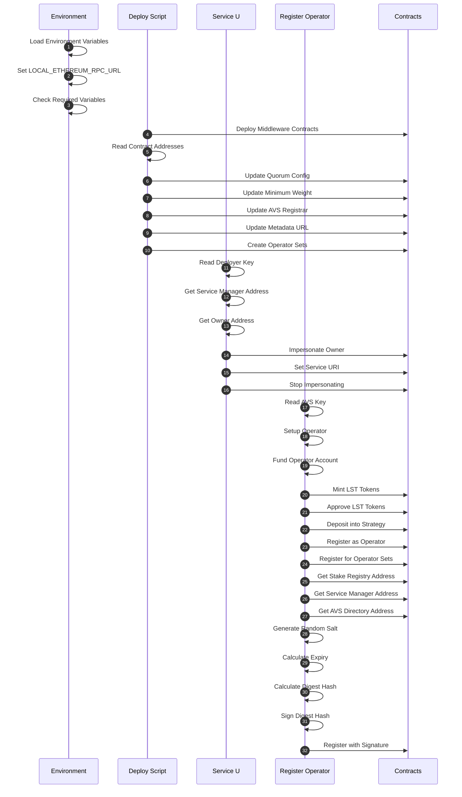

# WIP

TODO:

- POA Opset (ECDSAStakeRegistry compatible) #55
- Rename contracts

## Prerequisites

- Docker and Docker Compose

# Docker Quick start

## Build

First, ensure you have all submodules:

```bash
git submodule update --init --recursive
```

Then, build the image:

```bash
docker build -t wavs-middleware .
```

## Setup

Prepare the env file:

```bash
cp docker/env.example docker/.env
```

Edit the .env file with your configuration:

- Add a funded private key to `FUNDED_KEY` (with or without 0x prefix)
- Set `METADATA_URI` to your project's metadata
- For testnet deployment:
  - Set `DEPLOY_ENV` to "TESTNET"
  - Add your testnet RPC URL to `TESTNET_RPC_URL`
  - Make sure your `FUNDED_KEY` has enough ETH on the testnet

## Testnet Fork (For Local Development)

Start anvil in one terminal:

```bash
source docker/.env
anvil --fork-url $RPC_URL --host 0.0.0.0 --port 8545
```

## Deploy

Deploy:

```bash
docker run --rm --network host --env-file docker/.env -v ./deployments:/wavs/deployments -v ./.nodes:/root/.nodes wavs-middleware
```

### Set Service URI:

```bash
SERVICE_URI="https://ipfs.url/for-custom-service.json"

docker run --rm --network host --env-file docker/.env -v ./deployments:/wavs/deployments -v ./.nodes:/root/.nodes --entrypoint /wavs/docker/set_service_uri.sh wavs-middleware "$SERVICE_URI"
```

### Registering an operator with existing LST tokens

If you want to register an operator using your existing LST tokens (like stETH):

```bash
# Generate a new operator key
AVS_KEY=$(cast wallet new --json | jq -r '.[0].private_key')
OPERATOR_ADDRESS=$(cast wallet addr --private-key "$AVS_KEY")
echo "New operator address: $OPERATOR_ADDRESS"

# Transfer some LST tokens to the operator (we use 0.15 stETH to ensure sufficient stake)
source docker/.env
cast send --rpc-url $TESTNET_RPC_URL --private-key $FUNDED_KEY \
    $LST_CONTRACT_ADDRESS "transfer(address,uint256)(bool)" \
    $OPERATOR_ADDRESS 150000000000000000  # 0.15 stETH

# Register the operator
docker run --rm --network host --env-file docker/.env -v ./deployments:/wavs/deployments -v ./.nodes:/root/.nodes \
    --entrypoint /wavs/docker/register_operator.sh wavs-middleware "$AVS_KEY"

# Check the operator's weight
./docker/check_operator.sh $OPERATOR_ADDRESS
```

##### Important: LST Tokens Required for Operator Registration

Note that operators will not appear in the weight lists unless they have LST tokens staked. The registration process has two main parts:

1. **Basic registration**: This allows the operator to participate in the network but with zero weight
2. **Staking**: Only operators with staked tokens will appear in `list_operators.sh` output and have voting weight

To get your operator fully registered with weight:

1. Acquire LST tokens for the operator address by getting testnet ETH ([holesky](https://holesky-faucet.pk910.de/#/) or [sepolia](https://sepolia-faucet.pk910.de/)), and [liquid staking it with Lido](https://stake-holesky.testnet.fi/).
2. Run the registration script which will automatically stake any available tokens

### Update stakes

```bash
# IMPORTANT: After registering operators, you must update their stakes to have them recognized with proper weights
# You MUST specify at least one operator address as an argument
OPERATOR_ADDRESS=$(cast wallet addr --private-key "$AVS_KEY")
docker run --rm --network host --env-file docker/.env -v ./deployments:/wavs/deployments -v ./.nodes:/root/.nodes \
  --entrypoint /wavs/docker/update_stakes.sh wavs-middleware $OPERATOR_ADDRESS
```

Check a specific operator's weight:

```bash
# Check if an operator address has registered and with what weight, you can optionally pass in a list of addresses
docker run --rm --network host --env-file docker/.env -v ./deployments:/wavs/deployments -v ./.nodes:/root/.nodes --entrypoint /wavs/docker/check_operator.sh wavs-middleware $OPERATOR_ADDRESS
```

List Operators:

```bash
# View stake registry status, including registered operators and their weights
docker run --rm --network host --env-file docker/.env -v ./deployments:/wavs/deployments -v ./.nodes:/root/.nodes --entrypoint /wavs/docker/list_operators.sh wavs-middleware
```

## Deployment Files

The system stores deployment information in two locations:

1. `./deployments/wavs-middleware/<chain_id>.json` - Main deployment file
2. `~/.nodes/avs_deploy.json` - Copy used by node processes

All scripts have been improved to search for files in multiple locations and provide detailed error messages if files cannot be found or accessed.

## Local vs Testnet Deployment

### Local Deployment

- Set `DEPLOY_ENV=LOCAL` in .env
- Start anvil with `anvil --fork-url $RPC_URL --host 0.0.0.0 --port 8545`
- The private key doesn't need to be funded on the network, since it's a local fork

### Testnet Deployment

- Set `DEPLOY_ENV=TESTNET` in .env
- Add your testnet RPC URL to `TESTNET_RPC_URL`
- Ensure your `FUNDED_KEY` has enough ETH on the testnet
- No need to run anvil

## Troubleshooting

Common issues:

1. **Insufficient funds error**: Make sure your key in `FUNDED_KEY` has enough ETH on the testnet for deployment.

2. **Environment variables not found**: Make sure you're passing the .env file correctly with `--env-file docker/.env`.

3. **Script execution permission errors**: If you get permission errors, make sure the scripts are executable:
   ```bash
   chmod +x docker/*.sh
   ```

## References

- [EigenLayer Documentation](https://docs.eigenlayer.xyz/)
- [Hello World AVS Repository](https://github.com/Layr-Labs/eigenlayer-hello-world)

## Deployment Process Flow



## Detailed Process Explanation

### Initial Setup

- Load environment variables from `.env` file
- Set `LOCAL_ETHEREUM_RPC_URL` based on environment (TESTNET or LOCAL)
- Check for required environment variables

### Deploy Process (deploy.sh)

1. Deploy middleware contracts using Forge script
2. Read contract addresses from deployment JSON
3. Update quorum config with strategy weights
4. Set minimum weight for operators
5. Configure AVS registrar
6. Update metadata URL for EigenLayer frontend
7. Create operator sets for meta-AVS functionality

### Set Service URI (set_service_uri.sh)

1. Read deployer private key from file
2. Get service manager address from deployment JSON
3. Get owner address from service manager contract
4. Impersonate owner account (LOCAL only)
5. Set service URI on service manager contract
6. Stop impersonating owner account

### Register Operator (register_operator.sh)

1. Read AVS private key from command line
2. Setup operator with initial configuration
3. Fund operator account with ETH
4. Mint LST tokens for operator
5. Approve LST tokens for strategy manager
6. Deposit LST tokens into strategy
7. Register as operator with delegation manager
8. Register for operator sets with allocation manager
9. Register with AVS using signature:
   - Get stake registry address
   - Get service manager address
   - Get AVS directory address
   - Generate random salt
   - Calculate expiry time
   - Calculate digest hash
   - Sign digest hash with private key
   - Register with signature on stake registry

### Helper Functions

- `wait_for_ethereum`: Check if Ethereum node is ready
- `impersonate_account`: Impersonate an account (LOCAL only)
- `execute_transaction`: Run a transaction and handle errors
- `stop_impersonating`: Stop impersonating an account (LOCAL only)

### Instructions on getting Holesky ETH

To get Holesky ETH for running on testnet:

1. PoW Mining Faucet:

   - Go to https://holesky-faucet.pk910.de/
   - Connect your wallet
   - Mine blocks in your browser to earn ETH
   - Rewards based on mining time/hashrate
   - No external requirements

2. Alchemy Faucet (Alternative):
   - Visit https://www.alchemy.com/faucets/holesky
   - Requires mainnet ETH balance to use
   - Connect wallet and verify ownership
   - Request funds (limits apply)
