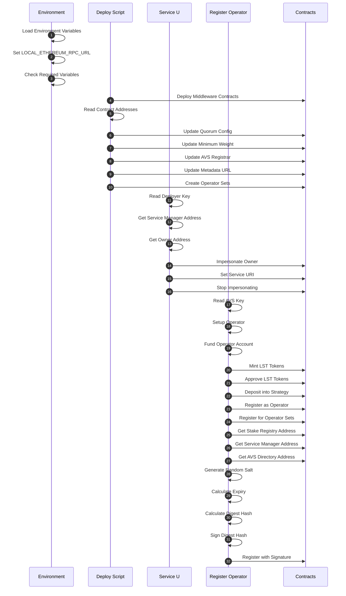

## Prerequisites

- Docker and Docker Compose

# Docker Quick start

## Build

First, ensure you have all submodules:

```bash
git submodule update --init --recursive
```

Then, build the image:

```bash
docker build -t wavs-middleware .
```

## Setup

Prepare the env file:

```bash
cp docker/env.example docker/.env
# edit the RPC_URL for a paid testnet rpc endpoint, add funded key, and TESTNET_RPC_URL
```

## Testnet Fork

Start anvil in one terminal:

```bash
source docker/.env
anvil --fork-url $RPC_URL --host 0.0.0.0 --port 8545
```

## Deploy

**Run all the following scripts in the `docker/` directory.**

```bash
cd docker/
```

Deploy:

```bash
docker run --rm --network host --env-file .env -v ./.nodes:/root/.nodes wavs-middleware
```

Set Service URI:

```bash
SERVICE_URI="https://ipfs.url/for-custom-service.json"

docker run --rm --network host --env-file .env -v ./.nodes:/root/.nodes --entrypoint /wavs/set_service_uri.sh wavs-middleware "$SERVICE_URI"
```

Register:

```bash
# TODO: get the private AVS key (0x...) for this service from the WAVS node
# Generate a new private key for the AVS
AVS_KEY=$(cast wallet new --json | jq -r '.[0].private_key')
# This will show the address, so you can confirm it was properly added when listing operators
cast wallet addr --private-key "$AVS_KEY"

docker run --rm --network host --env-file .env -v ./.nodes:/root/.nodes  --entrypoint /wavs/register.sh wavs-middleware "$AVS_KEY" "0.01ether"
```

List Operators:

```bash
# View stake registry status, including registered operators and their weights
docker run --rm --network host --env-file .env -v ./.nodes:/root/.nodes --entrypoint /wavs/list_operator.sh wavs-middleware
```

## Deploy Testnet

Same as the local deploy, but add `TESTNET_RPC_URL` to the .env and change `DEPLOY_ENV` to `"TESTNET"` and make sure the `PRIVATE_KEY` is actually funded on testnet

## References

- [EigenLayer Documentation](https://docs.eigenlayer.xyz/)
- [Hello World AVS Repository](https://github.com/Layr-Labs/eigenlayer-hello-world)

## Deployment Process Flow



## Detailed Process Explanation

### Initial Setup

- Load environment variables from `.env` file
- Set `LOCAL_ETHEREUM_RPC_URL` based on environment (TESTNET or LOCAL)
- Check for required environment variables

### Deploy Process (deploy.sh)

1. Deploy middleware contracts using Forge script
2. Read contract addresses from deployment JSON
3. Update quorum config with strategy weights
4. Set minimum weight for operators
5. Configure AVS registrar
6. Update metadata URL for EigenLayer frontend
7. Create operator sets for meta-AVS functionality

### Set Service URI (set_service_uri.sh)

1. Read deployer private key from file
2. Get service manager address from deployment JSON
3. Get owner address from service manager contract
4. Impersonate owner account (LOCAL only)
5. Set service URI on service manager contract
6. Stop impersonating owner account

### Register Operator (register.sh)

1. Read AVS private key from command line
2. Setup operator with initial configuration
3. Fund operator account with ETH
4. Mint LST tokens for operator
5. Approve LST tokens for strategy manager
6. Deposit LST tokens into strategy
7. Register as operator with delegation manager
8. Register for operator sets with allocation manager
9. Register with AVS using signature:
   - Get stake registry address
   - Get service manager address
   - Get AVS directory address
   - Generate random salt
   - Calculate expiry time
   - Calculate digest hash
   - Sign digest hash with private key
   - Register with signature on stake registry

### Helper Functions (helpers.sh)

- `wait_for_ethereum`: Check if Ethereum node is ready
- `impersonate_account`: Impersonate an account (LOCAL only)
- `execute_transaction`: Run a transaction and handle errors
- `stop_impersonating`: Stop impersonating an account (LOCAL only)

### Instructions on getting Holesky ETH

To get Holesky ETH for running on testnet:

1. PoW Mining Faucet:
   - Go to https://holesky-faucet.pk910.de/
   - Connect your wallet
   - Mine blocks in your browser to earn ETH
   - Rewards based on mining time/hashrate
   - No external requirements

2. Alchemy Faucet (Alternative):
   - Visit https://www.alchemy.com/faucets/holesky
   - Requires mainnet ETH balance to use
   - Connect wallet and verify ownership
   - Request funds (limits apply)
